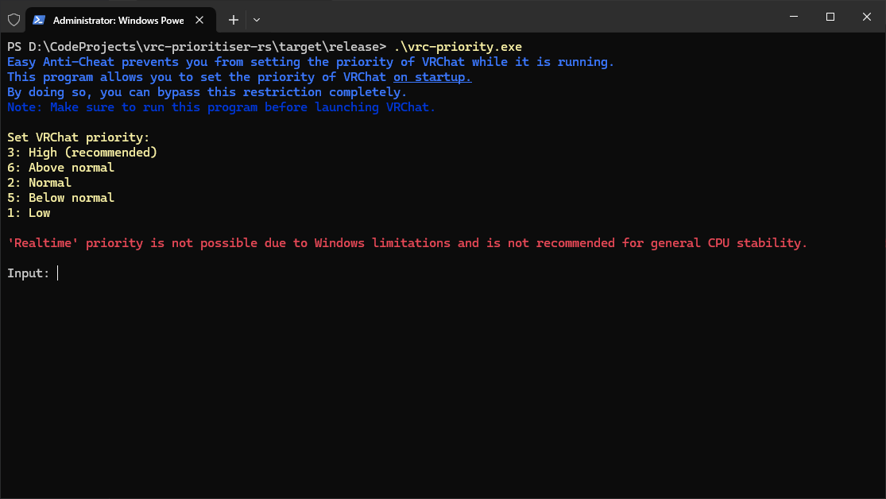

<!--
 Copyright (C) 2024 Kawaxte
 
 This file is part of vrc-priority-rs.
 
 vrc-priority-rs is free software: you can redistribute it and/or modify
 it under the terms of the GNU General Public License as published by
 the Free Software Foundation, either version 3 of the License, or
 (at your option) any later version.
 
 vrc-priority-rs is distributed in the hope that it will be useful,
 but WITHOUT ANY WARRANTY; without even the implied warranty of
 MERCHANTABILITY or FITNESS FOR A PARTICULAR PURPOSE.  See the
 GNU General Public License for more details.
 
 You should have received a copy of the GNU General Public License
 along with vrc-priority-rs.  If not, see <https://www.gnu.org/licenses/>.
-->

    

# VRChat Prioritiser

VRChat not too long ago added Easy Anti-Cheat, which prevents you from changing the priority of VRChat.exe through Task Manager. All *you* have to do is run it once and it will permanently set the priority of VRChat.exe to what you chose. 簡単簡単！

## Building from Source

### Prerequisites

Before you start, make sure you've got [Rust](https://www.rust-lang.org) on your computer. You can check if you've got Rust by typing `rustc --version` in your terminal.

In the meantime, if you're new to Rust, [check out this simplified guide](https://github.com/Dhghomon/easy_rust). I recommend this over the official Rust Book as it's easier to understand and doesn't use programmer jargon that most English speakers, native or not, may not understand.

### Compilation

Begin by typing `cargo build --release` to create an optimised executable, or `cargo build` to create an unoptimised executable with debug symbols.

After that, the `--release` version will be in `target/release` directory while latter will be in `target/debug` directory.

## Licence

This project is licenced under the [GNU General Public License v3.0](LICENSE). You can use the project for any purpose, but you must include the original copyright and licence.
